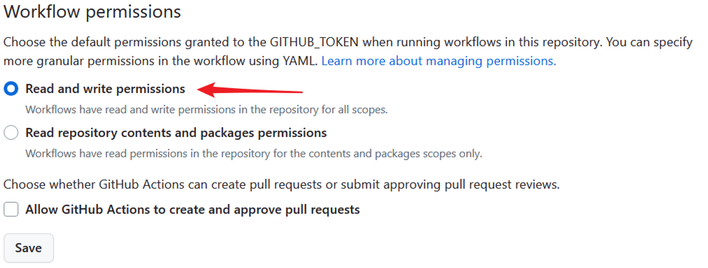

# PyBiliBackup
Automatically backup bilibili videos in your collections.


## Method
Use RSS to get new videos and bilix to download videos, finally we can upload them to onedrive.
Note: If you want to enable uploading to onedrive: see [About Onedrive](#About-Onedrive).

## Before start
Mainly designed for github action on public repos, the database file is simply encrypted to protect private data. The db in the repo is always encrypted with .encdb. So you need to generate your own key. To start, firstly delete the original database/database.encdb. Then run bili_backup/gen_key.py locally to get a key. This is the key to encrypte your database. You should fill this value into database_key(or identical env variable) in your private yaml or github repo secret first.
## Usage

### Use Github Action
> If you use onedrive API, [a onedrive with API](#About-Onedrive) is required to save your backup data.
> If you use rclone, you need to copy the content rclone.conf into the according secrect.

1. Fork the repo
2. Use your own information to set the needed secrets in your repo(Repo Settings -- Secrets and variables -- Actions -- Secrets). You need an email with SMTP host, port, account and app password. Check out [User config](#User-config) for the full config we need.

3. Enable Workflow r/w permissions
Settings -- Actions -- General


Then the action will be triggered when pushing to repo or reaching a certain time everyday. The latter can be set in the auto_download.yml. 
In the github action, the colorlog seems to bring some display errors, but it should not have effect on the code running.

Note that sometimes(or in most time, maybe related to VM's IP) when running via github action, the api bilix using sometimes seems unaccessible, causing backup failure.
If you feel it is unstable, the docker or local method is preferred for you, see the content below.

### Use Docker
1. Download the config file:
```
mkdir -p pybilibackup/files pybilibackup/database
wget https://github.com/Freddd13/pybilibackup/blob/main/localconfig.yaml?raw=true -O pybilibackup/.localconfig.yaml
```
2. Replace your own data in the yaml above. Check out [User config](#User-config) for the full config we need.
3. Download image and run:
- option1: using onedrive API:
    ```bash
    docker run -d --name pybilibackup \
    -v $(pwd)/pybilibackup/.localconfig.yaml:/app/.localconfig.yaml \
    -v $(pwd)/pybilibackup/files:/app/files \
    -v $(pwd)/pybilibackup/database:/app/database \
    fredyu13/pybilibackup:latest
    ```
- option2: using rclone:
    - 3.1 install and config rclone on you host
    - 3.2 copy your local rclone config for docker usage
    ```bash
    cat ~/.config/rclone/rclone.conf > pybilibackup/rclone.conf
    ```
    - 3.3 run docker once
    ```bash
    docker run -d --name pybilibackup \
    -v $(pwd)/pybilibackup/.localconfig.yaml:/app/.localconfig.yaml \
    -v $(pwd)/pybilibackup/rclone.conf:/root/.config/rclone/rclone.conf \
    -v $(pwd)/pybilibackup/files:/app/files \
    -v $(pwd)/pybilibackup/database:/app/database \
    -v $(pwd)/pybilibackup/database:/app/database \
    fredyu13/pybilibackup:latest

    ```
4. add task to crontab
    ```bash
    crontab -e
    ```

    add the following cmd:
    ```bash
    0 2 * * * /usr/bin/docker start pybilibackup
    ```

    check crontab:
    ```bash
    crontab -l
    ```


### User config(For Github Action Secrets, but it's similar for yaml)
| Variable                  | Description                                         | Example Value          |
|---------------------------|-----------------------------------------------------|------------------------|
| `Backup_database_key`     | The key you generated                   | `114514iiyokoiyo`      |
| `Backup_remove_local_files`     | whether to remove local files after uploading to remote                   | `1`      |
| `Backup_savefolder_path`     | backup root folder (relative to the repo)                   | `files` (recommended, if modified, remember to change the mounting accordingly when running docker)      |
| `RSS_url`                 | URL of the RSS feed.                               | `https://rsshub.app`|
| `RSS_key`                 | key of your self-hosted rsshub. url->url/SOMEROUTE?key={key} If you don't know what is it, just leave it empty.                               | `123`|
| `enable_email_notify`      | Whether to notify downloading result via email  (1 enable, 0 disable)  | `1` |
| `Email_sender`            | Email address used to send emails.                 | `sender@example.com`   |
| `Email_receivers`         | Email addresses designated to receive emails.      | `receiver@example.com` |
| `Email_smtp_host`         | SMTP server address used to send emails.           | `smtp.example.com`     |
| `Email_smtp_port`         | SMTP server port used to send emails.              | `11451`                  |
| `Email_mail_license`      | SMTP password or authorization used for sending emails.  | `1145141919810`  |
| `Email_send_logs`      | Whether to send email with logs (1 enable, 0 disable)  | `1`  |
| `enable_od_upload`      | Whether to backup to onedrive (1 enable, 0 disable)  | `0`  |
| `od_client_id`      | onedrive app client id  | `114514`  |
| `od_client_secret`      | onedrive app client secret value | `114514`  |
| `od_redirect_uri`      | onedrive app redirect_ur  | `http://localhost:9001`  |
| `od_upload_dir`      | which onedrive dir to save backup files(relative to the root, do NOT start with '/')  | `bili_backup`  |
| `enable_rclone_upload`      | whether to use rclone to backup to  remote (1 enable, 0 disable)  | `1`  |
| `rclone_upload_dir`      |  rclone drive path  | `onedrive-remote:/test_rclone`  |
| `rclone_conf_content`      |  rclone conf data  | raw conf copy from rclone.conf  |
| `BiliBili_users`      |  first fill in the given example yaml locally, then run the dump_yaml_to_json.py locally, finally paste the json in str format into the screct value                                                                         | json-like| |


## Develop
### Run locally
1. Clone this repo
2. Create a .localconfig.yaml from localconfig.yaml and fill in your data. Check out [User config](#User-config) for the full config we need.
3. `pip install -r requirements.txt`
4. Set env `BILIBILI_BACKUP_ENV` to `LOCAL`
4. `python main.py`

### Build Docker
1. Clone this repo
2. Create a .localconfig.yaml from localconfig.yaml and fill in your data. 
3. `docker build -t pybilibackup -f docker/Dockerfile .`
4. `docker run -d --name pybilibackup pybilibackup:latest`
The schedule task can be adjusted by modifing the ./docker/crontab.


## Note
### About RSS
Currently the repo depends on [Bilibili RSS from RSSHub](https://docs.rsshub.app/routes/social-media#up-%E4%B8%BB%E9%9D%9E%E9%BB%98%E8%AE%A4%E6%94%B6%E8%97%8F%E5%A4%B9). It's recommended to replace the domain with your self-hosted rsshub url, because the public hub can sometimes be banned by source sites. Besides, self-hosting one is quite benefit for your other future usage. If you don't have one, you can use the default url `https://rsshub.app/`.
For more info, please check [RSSHub doc](https://docs.rsshub.app/).


### About Onedrive
Currently the repo supports uploading to onedrive both from API and rclone(rclone maybe more stable).
- To save to onedrive via API, you need to create an app in [Azure](https://portal.azure.com/#home). Note that currently only onedrive business international is tested.
Check out [here](bili_backup/onedrive/README.md) for detailed instructions of getting required data.
The onedrive needs a login for the first time, after that the token will be saved to `_refresh_token`. As I have no idea how to receive auth callback in github action, the code assumes there's already a token file with token. Thus you need to run on local first to generate the token file. 
    For github action:
    1. Fork this repo,
    2. Follow [Run locally](#Run-locally) (clone your own repo) to run once.
    3. Check if the token file generates successfully, and push the code with token file to your repo.
    ```bash
    git add _refresh_token && git commit -m "add token" && git push -f
    ```
    4. Follow [Use Github Action](#Use-Github-Action)

- To save to onedrive via rclone. Just install and config rclone. If you deploy locally, just enable rclone in the config. If you use docker or github action, just copy the config file or content according to the instructions.


## TODO
- [x] docker
- [x] fix local storage check
- [x] fix bug when remaining history files
- [x] rclone for local
- [x] rclone for docker
- [ ] rclone for github action
- [ ] add retry history failed videos
- [ ] config from gist
- [ ] backup summary
- [ ] bot

# Acknowledgement
- [bilix](https://github.com/HFrost0/bilix)
- [bili-fav-sniffer](https://github.com/SummerLiu95/bili-fav-sniffer)
- [BiliBackup](https://github.com/Privilege-privacy/BiliBackup)
- [rsshub](https://github.com/DIYgod/RSSHub)

# Disclaimer:
```
This software is provided "as-is" for personal learning and educational purposes only. The use of this software is at your own risk. The developer is not responsible for any consequences that may arise from the use of this software.

By using this software, you acknowledge and agree to the following terms:

Personal Use Only: This software is intended solely for personal learning and educational purposes. Any form of distribution, commercial use, or sharing of this software or its output is strictly prohibited.

Compliance with Laws and Terms of Service: Users must comply with all relevant laws and regulations, as well as Bilibili's Terms of Service, when using this software. The developer does not endorse or condone any actions that violate these terms or any applicable laws.

No Liability: The developer shall not be liable for any direct, indirect, incidental, or consequential damages arising out of the use or inability to use this software. This includes but is not limited to any legal issues, data loss, or damage to your device.

Responsibility for Actions: Users are fully responsible for their actions when using this software. The developer assumes no responsibility for any misuse of the software or violations of Bilibili's Terms of Service.

Modifications and Updates: The developer reserves the right to modify or discontinue the software at any time without prior notice. Users are encouraged to check for updates regularly to ensure compliance with the latest terms and regulations.

By downloading and using this software, you agree to these terms and accept full responsibility for your actions.
```